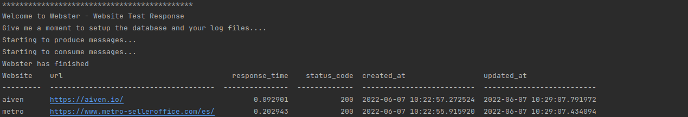

=======
Webster - Website Test Response
=======

Author: Raquel V

**Disclaimer**

If you have arrived to this project, take into account that this project is my very first Python project
and may not be following the best practices, this project has been done as a practice for using Aiven.io services
so do not take it as an example for your duties although it can inspire you.

-----
Getting Started in Webster
-----

Webster is a system that monitors Website availability over the network,
produce metrics about this and passes these events through Kafka into PostgreSQL db.
Those metrics will be stored:
    - as historical data in a table called: 'webster_metrics_history'
    - as live data with no duplicates in a table called: 'webster_metrics'

Ideally this could run periodically for example by a cronjob or any other scheduler, to simulate that in execution time
I just added a loop in the main.

For this project we will use Aiven instances, like Kafka, and PostgreSQL but feel free to configure all you need
by the following:

1. Prepare the list of Urls you want to track. Go to resources/urls.json and add there the list of them, by default
the project comes with some examples (you can skip this part).
For example:
..code:: json
    {
        "urls": [
            {
                "metro": "https://YOURURL/"
            },
            {
                "aiven": "https://aiven.io/"
            }
        ]
    }
2. Creates a Virtualenv
    make virtualenv

3. Setup the project
    make setup

4. Add your certs files into certs folder (.pem,cert,key)

5. Update the new config.ini prepared by the setup and configure your parameters
    You will need: (absolute path)
        - virtualenv
        - Database instance
        - Kafka instance
        - URL of a Json file with your websites to check
        - Path for your logging files

6. Run your code
    make run

7. Outcome - Your outcome should be similar to the one below

-----
Requirements
-----
    * PostgreSQL Instance
    * Kafka Instance
    * Python3.8
    Python Libraries
        * setuptools
        * psycopg2-binary
        * kafka-python
        * requests
        * tabulate
Note: It is really important you have upgraded version for  python3-setuptools
sudo apt-get install python3-setuptools

----
Troubleshooting
----
I have notice that sometimes there is a lag between producer and consumer, I have not find out yet why, but I think
the consumer is slower for some reason. If this happens to you in your tests, please go to consumer.py
remove the consumer_timeout_ms, run the project, it will catch up eventually and then put back the timeout.
I will continue investigating why it can be.

-----
Missing parts
-----
This project is not covered by test, do not do that! If you are going to implement something similar please do you test.

-----
Attributions
-----
https://developer.aiven.io/
https://kafka-python.readthedocs.io/
https://realpython.com

-----
Contributions
-----
If you wanna contribute in this project please read Contribution_.

.. _CONTRIBUTING:

-----
Code of conduct
-----
Refer to https://www.contributor-covenant.org/ to follow the code of conduct for Open Source projects